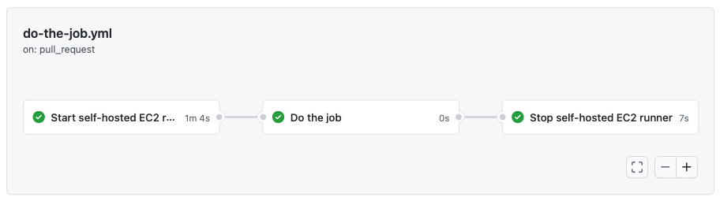

# On-demand self-hosted AWS EC2 runner for GitHub Actions

⚠️ If you like the project, please consider [supporting Ukraine](https://bit.ly/3KeY7dc) in a [war](https://en.wikipedia.org/wiki/2022_Russian_invasion_of_Ukraine) against russian occupants. Any help would be much appreciated!

[](https://supportukrainenow.org)

(image by [Nina Dzyvulska](https://www.behance.net/ninadz))

---

[](https://github.com/jonico/awesome-runners)

Start your EC2 [self-hosted runner](https://docs.github.com/en/free-pro-team@latest/actions/hosting-your-own-runners) right before you need it.
Run the job on it.
Finally, stop it when you finish.
And all this automatically as a part of your GitHub Actions workflow.



See [below](#example) the YAML code of the depicted workflow. <br><br>

**Table of Contents**

- [Use cases](#use-cases)
  - [Access private resources in your VPC](#access-private-resources-in-your-vpc)
  - [Customize hardware configuration](#customize-hardware-configuration)
  - [Save costs](#save-costs)
- [Usage](#usage)
  - [How to start](#how-to-start)
  - [Inputs](#inputs)
  - [Environment variables](#environment-variables)
  - [Outputs](#outputs)
  - [Example](#example)
  - [Real user examples](#real-user-examples)
- [Self-hosted runner security with public repositories](#self-hosted-runner-security-with-public-repositories)
- [License Summary](#license-summary)

## Use cases

### Access private resources in your VPC

The action can start the EC2 runner in any subnet of your VPC that you need - public or private.
In this way, you can easily access any private resources in your VPC from your GitHub Actions workflow.

For example, you can access your database in the private subnet to run the database migration.

### Customize hardware configuration

GitHub provides one fixed hardware configuration for their Linux virtual machines: 2-core CPU, 7 GB of RAM, 14 GB of SSD disk space.

Some of your CI workloads may require more powerful hardware than GitHub-hosted runners provide.
In the action, you can configure any EC2 instance type for your runner that AWS provides.

For example, you may run a c5.4xlarge EC2 runner for some of your compute-intensive workloads.
Or r5.xlarge EC2 runner for workloads that process large data sets in memory.

### Save costs

If your CI workloads don't need the power of the GitHub-hosted runners and the execution takes more than a couple of minutes,
you can consider running it on a cheaper and less powerful instance from AWS.

According to [GitHub's documentation](https://docs.github.com/en/free-pro-team@latest/actions/hosting-your-own-runners/about-self-hosted-runners), you don't need to pay for the jobs handled by the self-hosted runners:

> Self-hosted runners are free to use with GitHub Actions, but you are responsible for the cost of maintaining your runner machines.

So you will be charged by GitHub only for the time the self-hosted runner start and stop.
EC2 self-hosted runner will handle everything else so that you will pay for it to AWS, which can be less expensive than the price for the GitHub-hosted runner.

## Usage

### How to start

Use the following steps to prepare your workflow for running on your EC2 self-hosted runner:

**1. Prepare IAM user with AWS access keys**

1. Create new AWS access keys for the new or an existing IAM user with the following least-privilege minimum required permissions:

   ```
   {
     "Version": "2012-10-17",
     "Statement": [
       {
         "Effect": "Allow",
         "Action": [
           "ec2:RunInstances",
           "ec2:TerminateInstances",
           "ec2:DescribeInstances",
           "ec2:DescribeInstanceStatus"
         ],
         "Resource": "*"
       }
     ]
   }
   ```

   If you plan to attach an IAM role to the EC2 runner with the `iam-role-name` parameter, you will need to allow additional permissions:

   ```
   {
    "Version": "2012-10-17",
    "Statement": [
      {
        "Effect": "Allow",
        "Action": [
          "ec2:ReplaceIamInstanceProfileAssociation",
          "ec2:AssociateIamInstanceProfile"
        ],
        "Resource": "*"
      },
      {
        "Effect": "Allow",
        "Action": "iam:PassRole",
        "Resource": "*"
      }
    ]
   }
   ```

   If you use the `aws-resource-tags` parameter, you will also need to allow the permissions to create tags:

   ```
   {
    "Version": "2012-10-17",
    "Statement": [
      {
        "Effect": "Allow",
        "Action": [
          "ec2:CreateTags"
        ],
        "Resource": "*",
        "Condition": {
          "StringEquals": {
            "ec2:CreateAction": "RunInstances"
          }
        }
      }
    ]
   }
   ```

   These example policies above are provided as a guide. They can and most likely should be limited even more by specifying the resources you use.

2. Add the keys to GitHub secrets.
3. Use the [aws-actions/configure-aws-credentials](https://github.com/aws-actions/configure-aws-credentials) action to set up the keys as environment variables.

**2. Prepare GitHub personal access token**

1. Create a new GitHub personal access token with the `repo` scope.
   The action will use the token for self-hosted runners management in the GitHub account on the repository level.
2. Add the token to GitHub secrets.

**3. Prepare EC2 image**

1. Create a new EC2 instance based on any Linux distribution you need.
2. Connect to the instance using SSH, install `docker` and `git`, then enable `docker` service.

   For Amazon Linux 2, it looks like the following:

   ```
    sudo yum update -y && \
    sudo yum install docker -y && \
    sudo yum install git -y && \
    sudo yum install libicu -y && \
    sudo systemctl enable docker
   ```

   For other Linux distributions, it could be slightly different.

3. Install any other tools required for your workflow.
4. Create a new EC2 image (AMI) from the instance.
5. Remove the instance if not required anymore after the image is created.

Alternatively, you can use a vanilla EC2 AMI and set up the dependencies via `pre-runner-script` in the workflow YAML file. See example in the `pre-runner-script` documentation below.

**4. Prepare VPC with subnet and security group**

1. Create a new VPC and a new subnet in it.
   Or use the existing VPC and subnet.
2. Create a new security group for the runners in the VPC.
   Only the outbound traffic on port 443 should be allowed for pulling jobs from GitHub.
   No inbound traffic is required.

**5. Configure the GitHub workflow**

1. Create a new GitHub Actions workflow or edit the existing one.
2. Use the documentation and example below to configure your workflow.
3. Please don't forget to set up a job for removing the EC2 instance at the end of the workflow execution.
   Otherwise, the EC2 instance won't be removed and continue to run even after the workflow execution is finished.

Now you're ready to go!

### Inputs

| &nbsp;&nbsp;&nbsp;&nbsp;&nbsp;&nbsp;&nbsp;&nbsp;&nbsp;&nbsp;&nbsp;&nbsp;&nbsp;&nbsp;Name&nbsp;&nbsp;&nbsp;&nbsp;&nbsp;&nbsp;&nbsp;&nbsp;&nbsp;&nbsp;&nbsp;&nbsp;&nbsp;&nbsp; | Required                                   | Description                                                                                                                                                                                                                                                                                                                           |
| ---------------------------------------------------------------------------------------------------------------------------------------------------------------------------- | ------------------------------------------ | ------------------------------------------------------------------------------------------------------------------------------------------------------------------------------------------------------------------------------------------------------------------------------------------------------------------------------------- |
| `mode`                                                                                                                                                                       | Always required.                           | Specify here which mode you want to use: <br> - `start` - to start a new runner; <br> - `stop` - to stop the previously created runner.                                                                                                                                                                                               |
| `github-token`                                                                                                                                                               | Always required.                           | GitHub Personal Access Token with the `repo` scope assigned.                                                                                                                                                                                                                                                                          |
| `ec2-image-id`                                                                                                                                                               | Required if you use the `start` mode.      | EC2 Image Id (AMI). <br><br> The new runner will be launched from this image. <br><br> The action is compatible with Amazon Linux 2 images.                                                                                                                                                                                           |
| `ec2-instance-type`                                                                                                                                                          | Required if you use the `start` mode.      | EC2 Instance Type.                                                                                                                                                                                                                                                                                                                    |
| `subnet-id`                                                                                                                                                                  | Required if you use the `start` mode.      | VPC Subnet Id. <br><br> The subnet should belong to the same VPC as the specified security group.                                                                                                                                                                                                                                     |
| `security-group-id`                                                                                                                                                          | Required if you use the `start` mode.      | EC2 Security Group Id. <br><br> The security group should belong to the same VPC as the specified subnet. <br><br> Only the outbound traffic for port 443 should be allowed. No inbound traffic is required.                                                                                                                          |
| `label`                                                                                                                                                                      | Required if you use the `stop` mode.       | Name of the unique label assigned to the runner. <br><br> The label is provided by the output of the action in the `start` mode. <br><br> The label is used to remove the runner from GitHub when the runner is not needed anymore.                                                                                                   |
| `ec2-instance-id`                                                                                                                                                            | Required if you use the `stop` mode.       | EC2 Instance Id of the created runner. <br><br> The id is provided by the output of the action in the `start` mode. <br><br> The id is used to terminate the EC2 instance when the runner is not needed anymore.                                                                                                                      |
| `iam-role-name`                                                                                                                                                              | Optional. Used only with the `start` mode. | IAM role name to attach to the created EC2 runner. <br><br> This allows the runner to have permissions to run additional actions within the AWS account, without having to manage additional GitHub secrets and AWS users. <br><br> Setting this requires additional AWS permissions for the role launching the instance (see above). |
| `aws-resource-tags`                                                                                                                                                          | Optional. Used only with the `start` mode. | Specifies tags to add to the EC2 instance and any attached storage. <br><br> This field is a stringified JSON array of tag objects, each containing a `Key` and `Value` field (see example below). <br><br> Setting this requires additional AWS permissions for the role launching the instance (see above).                         |
| `runner-home-dir`                                                                                                                                                              | Optional. Used only with the `start` mode. | Specifies a directory where pre-installed actions-runner software and scripts are located.<br><br> |
| `pre-runner-script`                                                                                                                                                              | Optional. Used only with the `start` mode. | Specifies bash commands to run before the runner starts.  It's useful for installing dependencies with apt-get, yum, dnf, etc. For example:<pre>          - name: Start EC2 runner<br>            with:<br>              mode: start<br>              ...<br>              pre-runner-script: \|<br>                 sudo yum update -y && \ <br>                 sudo yum install docker git libicu -y<br>                 sudo systemctl enable docker</pre>
`key-name`                                                                                                                                                              | Optional. Used only with the `start` mode. | Specifies SSH key-pair name to assign to an instance.  This is useful for SSHing into an instance for debugging.<br><br> |
| `block-device-mapping`                                                                                                                                                              | Optional. Used only with the `start` mode. | JSON string specifying the [BlockDeviceMapping](https://docs.aws.amazon.com/AWSCloudFormation/latest/UserGuide/aws-properties-ec2-blockdev-mapping.html).  For example:<pre> block-device-mapper: \|<br>   [<br>   {"DeviceName" : "/dev/sda1", "Ebs" : { "VolumeType": "gp2", "VolumeSize": 34 }},<br>   {"DeviceName" : "/dev/sdb", "VirtualName": "ephemeral0" }<br>   ]
</pre>|

### Environment variables

In addition to the inputs described above, the action also requires the following environment variables to access your AWS account:

- `AWS_DEFAULT_REGION`
- `AWS_REGION`
- `AWS_ACCESS_KEY_ID`
- `AWS_SECRET_ACCESS_KEY`

We recommend using [aws-actions/configure-aws-credentials](https://github.com/aws-actions/configure-aws-credentials) action right before running the step for creating a self-hosted runner. This action perfectly does the job of setting the required environment variables.

### Outputs

| &nbsp;&nbsp;&nbsp;&nbsp;&nbsp;&nbsp;&nbsp;&nbsp;&nbsp;&nbsp;&nbsp;&nbsp;&nbsp;&nbsp;Name&nbsp;&nbsp;&nbsp;&nbsp;&nbsp;&nbsp;&nbsp;&nbsp;&nbsp;&nbsp;&nbsp;&nbsp;&nbsp;&nbsp; | Description                                                                                                                                                                                                                               |
| ---------------------------------------------------------------------------------------------------------------------------------------------------------------------------- | ----------------------------------------------------------------------------------------------------------------------------------------------------------------------------------------------------------------------------------------- |
| `label`                                                                                                                                                                      | Name of the unique label assigned to the runner. <br><br> The label is used in two cases: <br> - to use as the input of `runs-on` property for the following jobs; <br> - to remove the runner from GitHub when it is not needed anymore. |
| `ec2-instance-id`                                                                                                                                                            | EC2 Instance Id of the created runner. <br><br> The id is used to terminate the EC2 instance when the runner is not needed anymore.                                                                                                       |

### Example

The workflow showed in the picture above and declared in `do-the-job.yml` looks like this:

```yml
name: do-the-job
on: pull_request
jobs:
  start-runner:
    name: Start self-hosted EC2 runner
    runs-on: ubuntu-latest
    outputs:
      label: ${{ steps.start-ec2-runner.outputs.label }}
      ec2-instance-id: ${{ steps.start-ec2-runner.outputs.ec2-instance-id }}
    steps:
      - name: Configure AWS credentials
        uses: aws-actions/configure-aws-credentials@v1
        with:
          aws-access-key-id: ${{ secrets.AWS_ACCESS_KEY_ID }}
          aws-secret-access-key: ${{ secrets.AWS_SECRET_ACCESS_KEY }}
          aws-region: ${{ secrets.AWS_REGION }}
      - name: Start EC2 runner
        id: start-ec2-runner
        uses: machulav/ec2-github-runner@v2
        with:
          mode: start
          github-token: ${{ secrets.GH_PERSONAL_ACCESS_TOKEN }}
          ec2-image-id: ami-123
          ec2-instance-type: t3.nano
          subnet-id: subnet-123
          security-group-id: sg-123
          iam-role-name: my-role-name # optional, requires additional permissions
          aws-resource-tags: > # optional, requires additional permissions
            [
              {"Key": "Name", "Value": "ec2-github-runner"},
              {"Key": "GitHubRepository", "Value": "${{ github.repository }}"}
            ]
          key-name: my-ssh-key # optional
          block-device-mapper: | # optional
            [
            {"DeviceName" : "/dev/sda1", "Ebs" : { "VolumeType": "gp2", "VolumeSize": 34 }},
            {"DeviceName" : "/dev/sdb", "VirtualName": "ephemeral0" }
            ]
  do-the-job:
    name: Do the job on the runner
    needs: start-runner # required to start the main job when the runner is ready
    runs-on: ${{ needs.start-runner.outputs.label }} # run the job on the newly created runner
    steps:
      - name: Hello World
        run: echo 'Hello World!'
  stop-runner:
    name: Stop self-hosted EC2 runner
    needs:
      - start-runner # required to get output from the start-runner job
      - do-the-job # required to wait when the main job is done
    runs-on: ubuntu-latest
    if: ${{ always() }} # required to stop the runner even if the error happened in the previous jobs
    steps:
      - name: Configure AWS credentials
        uses: aws-actions/configure-aws-credentials@v1
        with:
          aws-access-key-id: ${{ secrets.AWS_ACCESS_KEY_ID }}
          aws-secret-access-key: ${{ secrets.AWS_SECRET_ACCESS_KEY }}
          aws-region: ${{ secrets.AWS_REGION }}
      - name: Stop EC2 runner
        uses: machulav/ec2-github-runner@v2
        with:
          mode: stop
          github-token: ${{ secrets.GH_PERSONAL_ACCESS_TOKEN }}
          label: ${{ needs.start-runner.outputs.label }}
          ec2-instance-id: ${{ needs.start-runner.outputs.ec2-instance-id }}
```

### Real user examples

In [this discussion](https://github.com/machulav/ec2-github-runner/discussions/19), you can find feedback and examples from the users of the action.

If you use this action in your workflow, feel free to add your story there as well 🙌

## Self-hosted runner security with public repositories

> We recommend that you do not use self-hosted runners with public repositories.
>
> Forks of your public repository can potentially run dangerous code on your self-hosted runner machine by creating a pull request that executes the code in a workflow.

Please find more details about this security note on [GitHub documentation](https://docs.github.com/en/free-pro-team@latest/actions/hosting-your-own-runners/about-self-hosted-runners#self-hosted-runner-security-with-public-repositories).

## License Summary

This code is made available under the [MIT license](LICENSE).
