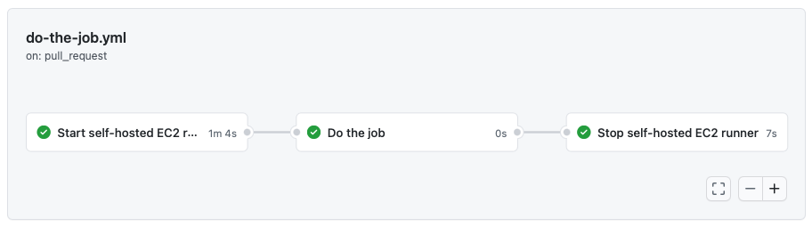

# On-demand self-hosted AWS EC2 runner for GitHub Actions

⚠️ If you like the project, please consider [supporting Ukraine](https://prytulafoundation.org/en) in a [war](https://en.wikipedia.org/wiki/Russian_invasion_of_Ukraine) against russian occupants. Any help would be much appreciated!

[](https://supportukrainenow.org)

(image by [Nina Dzyvulska](https://www.behance.net/ninadz))

---

[](https://github.com/jonico/awesome-runners)

Start your EC2 [self-hosted runner](https://docs.github.com/en/free-pro-team@latest/actions/hosting-your-own-runners) right before you need it.
Run the job on it.
Finally, stop it when you finish.
And all this automatically as a part of your GitHub Actions workflow.



See [below](#example) the YAML code of the depicted workflow. <br><br>

**Table of Contents**

- [Use cases](#use-cases)
  - [Access private resources in your VPC](#access-private-resources-in-your-vpc)
  - [Customize hardware configuration](#customize-hardware-configuration)
  - [Save costs](#save-costs)
- [Usage](#usage)
  - [How to start](#how-to-start)
  - [Inputs](#inputs)
  - [Environment variables](#environment-variables)
  - [Outputs](#outputs)
  - [Example](#example)
  - [Advanced: JIT runners](#advanced-jit-runners)
  - [Advanced: Multi-AZ failover](#advanced-multi-az-failover)
  - [Advanced: Debug mode](#advanced-debug-mode)
  - [Real user examples](#real-user-examples)
- [Self-hosted runner security with public repositories](#self-hosted-runner-security-with-public-repositories)
- [License Summary](#license-summary)

## Use cases

### Access private resources in your VPC

The action can start the EC2 runner in any subnet of your VPC that you need - public or private.
In this way, you can easily access any private resources in your VPC from your GitHub Actions workflow.

For example, you can access your database in the private subnet to run the database migration.

### Customize hardware configuration

GitHub provides one fixed hardware configuration for their Linux virtual machines: 2-core CPU, 7 GB of RAM, 14 GB of SSD disk space.

Some of your CI workloads may require more powerful hardware than GitHub-hosted runners provide.
In the action, you can configure any EC2 instance type for your runner that AWS provides.

For example, you may run a c5.4xlarge EC2 runner for some of your compute-intensive workloads.
Or r5.xlarge EC2 runner for workloads that process large data sets in memory.

### Save costs

If your CI workloads don't need the power of the GitHub-hosted runners and the execution takes more than a couple of minutes,
you can consider running it on a cheaper and less powerful instance from AWS.

According to [GitHub's documentation](https://docs.github.com/en/free-pro-team@latest/actions/hosting-your-own-runners/about-self-hosted-runners), you don't need to pay for the jobs handled by the self-hosted runners:

> Self-hosted runners are free to use with GitHub Actions, but you are responsible for the cost of maintaining your runner machines.

So you will be charged by GitHub only for the time the self-hosted runner start and stop.
EC2 self-hosted runner will handle everything else so that you will pay for it to AWS, which can be less expensive than the price for the GitHub-hosted runner.

## Usage

### How to start

Use the following steps to prepare your workflow for running on your EC2 self-hosted runner:

**1. Prepare IAM user with AWS access keys**

1. Create new AWS access keys for the new or an existing IAM user with the following least-privilege minimum required permissions:

   ```json
   {
     "Version": "2012-10-17",
     "Statement": [
       {
         "Effect": "Allow",
         "Action": [
           "ec2:RunInstances",
           "ec2:TerminateInstances",
           "ec2:DescribeInstances",
           "ec2:DescribeInstanceStatus"
         ],
         "Resource": "*"
       }
     ]
   }
   ```

   If you use the `runner-debug` input to enable debug logging, you will also need to allow the `ec2:GetConsoleOutput` permission so the action can poll the EC2 serial console output during startup:

   ```json
   {
     "Version": "2012-10-17",
     "Statement": [
       {
         "Effect": "Allow",
         "Action": [
           "ec2:GetConsoleOutput"
         ],
         "Resource": "*"
       }
     ]
   }
   ```

   If you plan to attach an IAM role to the EC2 runner with the `iam-role-name` parameter, you will need to allow additional permissions:

   ```json
   {
    "Version": "2012-10-17",
    "Statement": [
      {
        "Effect": "Allow",
        "Action": [
          "ec2:ReplaceIamInstanceProfileAssociation",
          "ec2:AssociateIamInstanceProfile"
        ],
        "Resource": "*"
      },
      {
        "Effect": "Allow",
        "Action": "iam:PassRole",
        "Resource": "*"
      }
    ]
   }
   ```

   If you use the `aws-resource-tags` parameter, you will also need to allow the permissions to create tags:

   ```json
   {
    "Version": "2012-10-17",
    "Statement": [
      {
        "Effect": "Allow",
        "Action": [
          "ec2:CreateTags"
        ],
        "Resource": "*",
        "Condition": {
          "StringEquals": {
            "ec2:CreateAction": "RunInstances"
          }
        }
      }
    ]
   }
   ```

   These example policies above are provided as a guide. They can and most likely should be limited even more by specifying the resources you use.


2. Add the keys to GitHub secrets.
3. Use the [aws-actions/configure-aws-credentials](https://github.com/aws-actions/configure-aws-credentials) action to set up the keys as environment variables.

> [!IMPORTANT]
> If you are planning on using Spot instances for your runner, AWS uses a service-linked role to provision the instances.
>
> For this to work, at least one of the following must be true:
> - The service-linked role exists already. This happens if you request a Spot instance via the AWS Console interface.
> - You create the service-linked role via the Console, AWS CLI or AWS API.
> - You grant the IAM role above permissions to create the service-linked role at runtime.
> See the docs [here](https://docs.aws.amazon.com/IAM/latest/UserGuide/id_roles_create-service-linked-role.html) and [here](https://docs.aws.amazon.com/AWSEC2/latest/UserGuide/service-linked-roles-spot-instance-requests.html) for more details.

**2. Prepare GitHub personal access token**

1. Create a new GitHub personal access token with the `repo` scope.
   The action will use the token for self-hosted runners management in the GitHub account on the repository level.
2. Add the token to GitHub secrets.

**3. Prepare EC2 image**

1. Create a new EC2 instance based on any Linux distribution you need.
2. Connect to the instance using SSH, install `docker` and `git`, then enable `docker` service.

   For Amazon Linux 2023:

   ```shell
    sudo dnf update -y && \
    sudo dnf install docker git libicu -y && \
    sudo systemctl enable docker
   ```

   For Amazon Linux 2:

   ```shell
    sudo yum update -y && \
    sudo yum install docker git libicu -y && \
    sudo systemctl enable docker
   ```

   For other Linux distributions, it could be slightly different.

3. Install any other tools required for your workflow.
4. Create a new EC2 image (AMI) from the instance.
5. Remove the instance if not required anymore after the image is created.

> **Important:** If your AMI was created from an instance that previously ran a GitHub Actions runner, make sure to delete the stale runner configuration files (`.runner`, `.credentials`, `.credentials_rsaparams`) from the runner directory before creating the AMI. The action handles this automatically, but a clean AMI avoids unnecessary warnings.

Alternatively, you can use a vanilla EC2 AMI and set up the dependencies via `pre-runner-script` or the `packages` input in the workflow YAML file.

> **Compatibility note:** This action uses a `#cloud-boothook` user-data format to ensure the setup script runs during cloud-init's init stage. This is compatible with Amazon Linux 2, Amazon Linux 2023, Ubuntu, and other distributions that support cloud-init. The boothook approach avoids issues with some AMIs where `cloud_final_modules` (used by `runcmd`) may be empty or misconfigured.

**4. Prepare VPC with subnet and security group**

1. Create a new VPC and a new subnet in it.
   Or use the existing VPC and subnet.
2. Create a new security group for the runners in the VPC.
   Only **outbound** traffic on port TCP/443 is required to pull jobs from GitHub.
   No inbound traffic is required for this purpose, but if your workflow needs to access external repositories or internal SSH, other ports like TCP/22, TCP/80, etc ... may be required.

**5. Configure the GitHub workflow**

1. Create a new GitHub Actions workflow or edit the existing one.
2. Use the documentation and example below to configure your workflow.
3. Please don't forget to set up a job for removing the EC2 instance at the end of the workflow execution.
   Otherwise, the EC2 instance won't be removed and continue to run even after the workflow execution is finished.

Now you're ready to go!

### Inputs

| Name | Required | Description |
| --- | --- | --- |
| `mode` | Always required. | Specify here which mode you want to use: <br> - `start` - to start a new runner; <br> - `stop` - to stop the previously created runner. |
| `github-token` | Always required. | GitHub Personal Access Token with the `repo` scope assigned. |
| `ec2-image-id` | Required if you use the `start` mode and don't provide `availability-zones-config`. | EC2 Image Id (AMI). The new runner will be launched from this image. Compatible with Amazon Linux 2, Amazon Linux 2023, and Ubuntu images. |
| `ec2-instance-type` | Required if you use the `start` mode. | EC2 Instance Type. Accepts a single type (e.g. `t3.micro`) or a JSON array of types (e.g. `'["t3.micro", "t3.small", "m5.large"]'`). When multiple types are specified, the action tries each in order until one succeeds. Useful for spot instances where capacity may vary by type. |
| `subnet-id` | Required if you use the `start` mode and don't provide `availability-zones-config`. | VPC Subnet Id. The subnet should belong to the same VPC as the specified security group. |
| `security-group-id` | Required if you use the `start` mode and don't provide `availability-zones-config`. | EC2 Security Group Id. The security group should belong to the same VPC as the specified subnet. Only outbound traffic for port 443 is required. No inbound traffic is required. |
| `label` | Required if you use the `stop` mode. | Name of the unique label assigned to the runner. The label is provided by the output of the action in the `start` mode. |
| `ec2-instance-id` | Required if you use the `stop` mode. | EC2 Instance Id of the created runner. The id is provided by the output of the action in the `start` mode. |
| `availability-zones-config` | Optional. Used only with the `start` mode. | JSON string array of objects for multi-AZ failover. Each object must contain `imageId`, `subnetId`, and `securityGroupId`. Optionally specify `region` per entry (defaults to `AWS_REGION`). When provided, takes precedence over individual `ec2-image-id`, `subnet-id`, and `security-group-id` parameters. See [Multi-AZ failover](#advanced-multi-az-failover). |
| `iam-role-name` | Optional. Used only with the `start` mode. | IAM role name to attach to the created EC2 runner. This allows the runner to have permissions to run additional actions within the AWS account. Requires additional AWS permissions (see above). |
| `aws-resource-tags` | Optional. Used only with the `start` mode. | Specifies tags to add to the EC2 instance and any attached storage. This field is a stringified JSON array of tag objects, each containing a `Key` and `Value` field. Requires additional AWS permissions (see above). |
| `runner-home-dir` | Optional. Used only with the `start` mode. | Specifies a directory where pre-installed actions-runner software and scripts are located. When set, the action skips downloading the runner and uses the pre-installed version. |
| `pre-runner-script` | Optional. Used only with the `start` mode. | Specifies bash commands to run before the runner starts. Useful for installing dependencies with apt-get, yum, dnf, etc. |
| `market-type` | Optional. Used only with the `start` mode. | Accepts only the value `spot`. If set, the runner will be launched as a Spot instance. If omitted, an on-demand instance is used. |
| `block-device-mappings` | Optional. Used only with the `start` mode. | JSON string specifying the block device mappings for the EC2 instance. See [AWS BlockDeviceMapping docs](https://docs.aws.amazon.com/AWSEC2/latest/APIReference/API_BlockDeviceMapping.html). |
| `metadata-options` | Optional. Used only with the `start` mode. | JSON string specifying the instance metadata options. Example: `'{"HttpTokens": "required", "HttpEndpoint": "enabled", "HttpPutResponseHopLimit": 2}'` |
| `packages` | Optional. Used only with the `start` mode. | JSON array of packages to install during boot via `yum` or `apt-get`. Example: `'["git", "docker.io", "nodejs"]'`. Default: `'[]'` |
| `run-runner-as-service` | Optional. Used only with the `start` mode. | When `true`, starts the runner as a systemd service using `svc.sh` instead of `run.sh`. Default: `false` |
| `run-runner-as-user` | Optional. Used only with the `start` mode. | Specify a user under whom the runner should run. The runner files will be `chown`'d to this user and the runner process will be started via `runuser -u <user>`. |
| `use-jit` | Optional. Used only with the `start` mode. | Enable JIT (Just-In-Time) runner configuration. Uses GitHub's `generate-jitconfig` API instead of the traditional `registration-token` approach. JIT runners are single-use and auto-deregister after completing one job. Incompatible with `run-runner-as-service: true`. Default: `false`. See [JIT runners](#advanced-jit-runners). |
| `runner-group-id` | Optional. Used only with the `start` mode. | The ID of the runner group to register the JIT runner in. Defaults to `1` (the "Default" runner group). Only used when `use-jit` is `true`. |
| `runner-debug` | Optional. Used only with the `start` mode. | Enable verbose debug logging for the runner setup. When `true`, the action logs detailed instance info, step-by-step script execution, and polls the EC2 serial console output during startup. Requires the `ec2:GetConsoleOutput` IAM permission (see above). Default: `false`. See [Debug mode](#advanced-debug-mode). |
| `startup-quiet-period-seconds` | Optional. | Quiet period in seconds before checking for runner registration. Default: `30` |
| `startup-retry-interval-seconds` | Optional. | Retry interval in seconds for checking runner registration. Default: `10` |
| `startup-timeout-minutes` | Optional. | Timeout in minutes for runner registration. Default: `5` |
| `ec2-volume-size` | Optional. | EC2 volume size in GB. Uses the AWS/AMI default if not provided. |
| `ec2-device-name` | Optional. | EC2 block device name. Default: `/dev/sda1` |
| `ec2-volume-type` | Optional. | EC2 block device type (e.g. `gp3`, `gp2`, `io1`). |

### Environment variables

In addition to the inputs described above, the action also requires the following environment variables to access your AWS account:

- `AWS_DEFAULT_REGION`
- `AWS_REGION`
- `AWS_ACCESS_KEY_ID`
- `AWS_SECRET_ACCESS_KEY`

We recommend using [aws-actions/configure-aws-credentials](https://github.com/aws-actions/configure-aws-credentials) action right before running the step for creating a self-hosted runner. This action perfectly does the job of setting the required environment variables.

### Outputs

| &nbsp;&nbsp;&nbsp;&nbsp;&nbsp;&nbsp;&nbsp;&nbsp;&nbsp;&nbsp;&nbsp;&nbsp;&nbsp;&nbsp;Name&nbsp;&nbsp;&nbsp;&nbsp;&nbsp;&nbsp;&nbsp;&nbsp;&nbsp;&nbsp;&nbsp;&nbsp;&nbsp;&nbsp; | Description                                                                                                                                                                                                                               |
| ---------------------------------------------------------------------------------------------------------------------------------------------------------------------------- | ----------------------------------------------------------------------------------------------------------------------------------------------------------------------------------------------------------------------------------------- |
| `label`                                                                                                                                                                      | Name of the unique label assigned to the runner. <br><br> The label is used in two cases: <br> - to use as the input of `runs-on` property for the following jobs; <br> - to remove the runner from GitHub when it is not needed anymore. |
| `ec2-instance-id`                                                                                                                                                            | EC2 Instance Id of the created runner. <br><br> The id is used to terminate the EC2 instance when the runner is not needed anymore.                                                                                                       |
| `region`                                                                                                                                                                      | AWS region where the EC2 instance was created. <br><br> This is useful for subsequent AWS operations on the instance.                                                                                                                     |


### Example

The workflow showed in the picture above and declared in `do-the-job.yml` looks like this:

```yml
name: do-the-job
on: pull_request
jobs:
  start-runner:
    name: Start self-hosted EC2 runner
    runs-on: ubuntu-latest
    outputs:
      label: ${{ steps.start-ec2-runner.outputs.label }}
      ec2-instance-id: ${{ steps.start-ec2-runner.outputs.ec2-instance-id }}
    steps:
      - name: Configure AWS credentials
        uses: aws-actions/configure-aws-credentials@v4
        with:
          aws-access-key-id: ${{ secrets.AWS_ACCESS_KEY_ID }}
          aws-secret-access-key: ${{ secrets.AWS_SECRET_ACCESS_KEY }}
          aws-region: ${{ secrets.AWS_REGION }}
      - name: Start EC2 runner
        id: start-ec2-runner
        uses: machulav/ec2-github-runner@v2
        with:
          mode: start
          github-token: ${{ secrets.GH_PERSONAL_ACCESS_TOKEN }}
          ec2-image-id: ami-123
          ec2-instance-type: t3.nano
          subnet-id: subnet-123
          security-group-id: sg-123
          iam-role-name: my-role-name # optional, requires additional permissions
          aws-resource-tags: > # optional, requires additional permissions
            [
              {"Key": "Name", "Value": "ec2-github-runner"},
              {"Key": "GitHubRepository", "Value": "${{ github.repository }}"}
            ]
          block-device-mappings: > # optional, to customize EBS volumes
            [
              {"DeviceName": "/dev/sda1", "Ebs": {"VolumeSize": 100, "VolumeType": "gp3"}}
            ]
  do-the-job:
    name: Do the job on the runner
    needs: start-runner # required to start the main job when the runner is ready
    runs-on: ${{ needs.start-runner.outputs.label }} # run the job on the newly created runner
    steps:
      - name: Hello World
        run: echo 'Hello World!'
  stop-runner:
    name: Stop self-hosted EC2 runner
    needs:
      - start-runner # required to get output from the start-runner job
      - do-the-job # required to wait when the main job is done
    runs-on: ubuntu-latest
    if: ${{ always() }} # required to stop the runner even if the error happened in the previous jobs
    steps:
      - name: Configure AWS credentials
        uses: aws-actions/configure-aws-credentials@v4
        with:
          aws-access-key-id: ${{ secrets.AWS_ACCESS_KEY_ID }}
          aws-secret-access-key: ${{ secrets.AWS_SECRET_ACCESS_KEY }}
          aws-region: ${{ secrets.AWS_REGION }}
      - name: Stop EC2 runner
        uses: machulav/ec2-github-runner@v2
        with:
          mode: stop
          github-token: ${{ secrets.GH_PERSONAL_ACCESS_TOKEN }}
          label: ${{ needs.start-runner.outputs.label }}
          ec2-instance-id: ${{ needs.start-runner.outputs.ec2-instance-id }}
```

### Advanced: JIT runners

JIT (Just-In-Time) runners use GitHub's `generate-jitconfig` API to create single-use runners that automatically deregister after completing one job. This eliminates the need for `config.sh` and simplifies cleanup.

JIT runners skip the traditional registration-token flow entirely. Instead, the encoded JIT config is passed directly to `./run.sh --jitconfig <config>`. The runner self-destructs after the job completes, so `stop` mode only terminates the EC2 instance (no GitHub runner removal needed).

> **Note:** JIT mode is incompatible with `run-runner-as-service: true` since JIT runners are inherently single-use.

```yml
      - name: Start EC2 runner
        id: start-ec2-runner
        uses: machulav/ec2-github-runner@v2
        with:
          mode: start
          github-token: ${{ secrets.GH_PERSONAL_ACCESS_TOKEN }}
          ec2-image-id: ami-123
          ec2-instance-type: t3.nano
          subnet-id: subnet-123
          security-group-id: sg-123
          use-jit: true
          runner-group-id: 1  # optional, defaults to the "Default" runner group
```

### Advanced: Multi-AZ failover

The `availability-zones-config` input allows you to specify multiple availability zone configurations. The action will try each one in sequence until an instance is successfully launched. This is useful for handling capacity issues or spot instance unavailability in a specific AZ.

Each configuration object requires `imageId`, `subnetId`, and `securityGroupId`. You can optionally specify a `region` per entry; if omitted, the `AWS_REGION` environment variable is used.

```yml
      - name: Start EC2 runner
        id: start-ec2-runner
        uses: machulav/ec2-github-runner@v2
        with:
          mode: start
          github-token: ${{ secrets.GH_PERSONAL_ACCESS_TOKEN }}
          ec2-instance-type: t3.nano
          market-type: spot
          availability-zones-config: >
            [
              {"imageId": "ami-123", "subnetId": "subnet-aaa", "securityGroupId": "sg-111"},
              {"imageId": "ami-456", "subnetId": "subnet-bbb", "securityGroupId": "sg-222", "region": "us-west-2"},
              {"imageId": "ami-789", "subnetId": "subnet-ccc", "securityGroupId": "sg-333", "region": "eu-west-1"}
            ]
```

### Advanced: Multiple instance types

When using spot instances, a specific instance type may not have available capacity. By specifying multiple instance types as a JSON array, the action will try each type in order until one succeeds. This is especially powerful when combined with multi-AZ failover — the action tries all instance types within each AZ before moving to the next AZ.

```yml
      - name: Start EC2 runner
        id: start-ec2-runner
        uses: machulav/ec2-github-runner@v2
        with:
          mode: start
          github-token: ${{ secrets.GH_PERSONAL_ACCESS_TOKEN }}
          ec2-image-id: ami-123
          ec2-instance-type: '["c5.xlarge", "c5a.xlarge", "c5d.xlarge", "m5.xlarge"]'
          subnet-id: subnet-123
          security-group-id: sg-123
          market-type: spot
```

> **Tip:** Choose instance types with similar vCPU/memory specs so your workload runs consistently regardless of which type is selected.

### Advanced: Debug mode

When a runner fails to register, it can be difficult to diagnose the issue because user-data scripts execute on the remote EC2 instance. The `runner-debug` input enables verbose logging to help with troubleshooting.

When `runner-debug: true` is set, the action will:

1. **Inject detailed echo statements** into the setup script on the instance — logging each step (architecture detection, runner download, config.sh execution, etc.)
2. **Poll the EC2 serial console output** during the registration wait loop, streaming new output to the GitHub Actions log as it appears
3. **Log the full user-data script** content so you can see exactly what was sent to the instance

This requires the `ec2:GetConsoleOutput` IAM permission. Add the following to your IAM policy:

```json
{
  "Version": "2012-10-17",
  "Statement": [
    {
      "Effect": "Allow",
      "Action": "ec2:GetConsoleOutput",
      "Resource": "*"
    }
  ]
}
```

> **Note:** EC2 serial console output takes 2-5 minutes to become available after instance launch and may not capture all output from user-data scripts. For full script logs, SSH into the instance and check `/tmp/runner-setup.log`.

```yml
      - name: Start EC2 runner
        id: start-ec2-runner
        uses: machulav/ec2-github-runner@v2
        with:
          mode: start
          github-token: ${{ secrets.GH_PERSONAL_ACCESS_TOKEN }}
          ec2-image-id: ami-123
          ec2-instance-type: t3.nano
          subnet-id: subnet-123
          security-group-id: sg-123
          runner-debug: true
          startup-timeout-minutes: 10  # increase timeout when debugging
```

### Real user examples

In [this discussion](https://github.com/machulav/ec2-github-runner/discussions/19), you can find feedback and examples from the users of the action.

If you use this action in your workflow, feel free to add your story there as well 🙌

## Self-hosted runner security with public repositories

> We recommend that you do not use self-hosted runners with public repositories.
>
> Forks of your public repository can potentially run dangerous code on your self-hosted runner machine by creating a pull request that executes the code in a workflow.

Please find more details about this security note on [GitHub documentation](https://docs.github.com/en/free-pro-team@latest/actions/hosting-your-own-runners/about-self-hosted-runners#self-hosted-runner-security-with-public-repositories).

## License Summary

This code is made available under the [MIT license](LICENSE).
